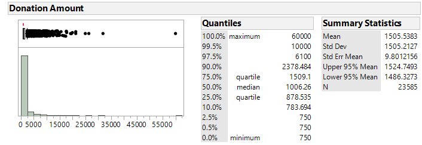
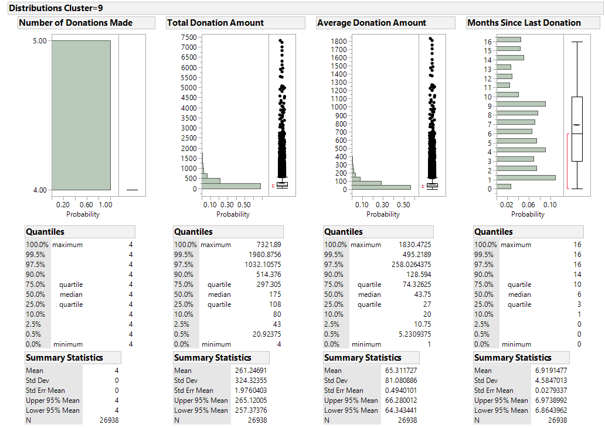
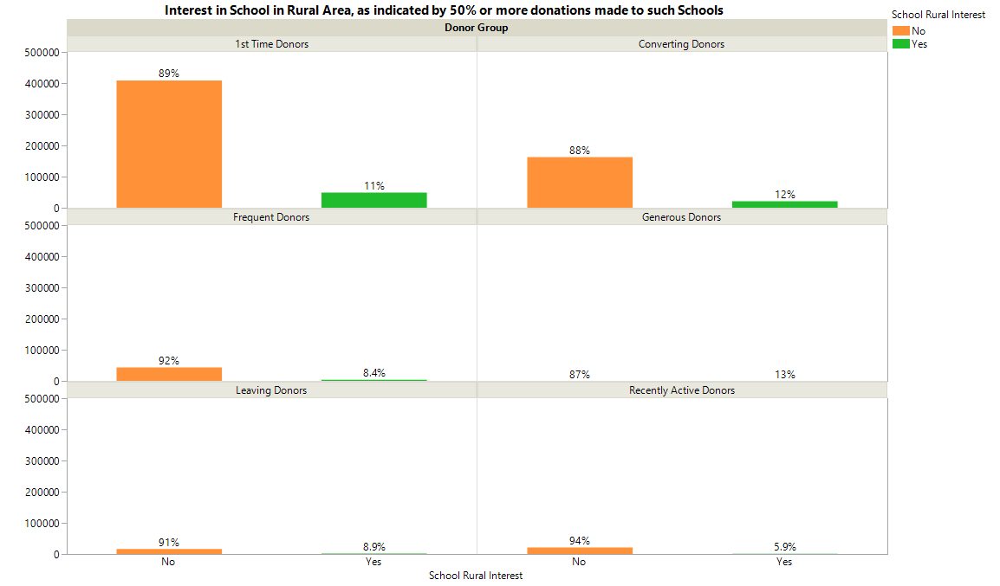

```{r setup, include=FALSE}
knitr::opts_chunk$set(echo = F)
knitr::opts_chunk$set(message = F)
knitr::opts_chunk$set(warning = F)
```

```{r libraries}
library(knitr)
```

# Data Analyics Lab Assignment 2

## Objective

The objective of the analysis is to find if there are different clusters of donors in the dataset and the kind of projects that will appeal to them. To achieve this, the donors of the dataset are subjected to RMF (Recency, Monetary and Frequency) clustering analyis to group donors based on those features. After which, each group's preferences are examined to investigate if there are certain project features that each group of donors favors.

The projects features used for preferences analysis includes:
- School Metro Type  
- Does more than half of the students of the school comes from low income families (School Percentage Free Lunch > 50)  
- Project Subject Category  
- Project Grade Level Category  

## Data Cleaning

### Donor.csv

Perfomed missing data pattern on the table. Found 1909543 complete observations, 33037 observations with missing Donor City values and 180060 observations with missing Donor City and Donor Zip values.

Observations with missing Donor City are not really much of a concern as the first 3 numbers of the zip code will suffice in identify the proximity of the donor to the proximity of the school. Distribution analysis performed on the Donor State and Donor Is Teacher varialbe shows that these observations are spreaded across different states and teacher status, indicating that the missing value may not be caused by data malfunctions. Therefore those observations are included in the clean dataset

Observations with both missing Donor City and Donor Zip are likewise subjected to further distribution analysis: the result reveals that roughly half of these observations have a Donor State value of "other", implying that these donors originated from out of United States. Such observations should be considered valid as these donors will not have a valid zip code. Observations with a non "other" Donor State value but with missing Donor Zip values are flagged out using a formula column Incomplete Location Info.

Flagging out the observations with incomplete location info is chosen over hiding and exluding action because the data given exists in a relational database form. Future exploratory analysis may require joining of the Donors table with other tables, in which the hidden and excluded rows may cause instances of missing data in the joined table

Summary statistics and distribtuion analysis on the Donor State, Donor Is Teacher and Donor Zip variable of the complete observations reveals no further abnormalies.

### Donations.csv

Performed missing data pattern on the table and found no observations with missing values in any variables

Gathered summary statistics Project ID, Donor ID, Donation Included Optional Donation, Donation Amount and Donation Received Date. Summary statistics showed that there are 2024554 unique donors contributing 4687844 donations to 901965 unique projects. The donation amount ranges from 0.01 dollars to 60000 dollars. The donation recieved date spans from 2012/10/08 to 2018/05/09.

The extreme values of donation amount warrants further investigation. Using distribution analysis on the Donation Amount reveals that the 0.5% qunatile and 99.5% quantile of the Donation Amount are 1 and 750 respectively. In total there are 377031 observations that are within either quantile, with Donation Amount <=1 taking up the majority at 354405 observations.

The 60000 Donation Amount value comes from a single Donation observation made in 2013/04/25. While this is not invalid data, it should be noted as a outlier as the next closest value comes in at 31856.6, which is slightly larger than half of the maximum value.

A closer examination on donation amounts lesser than 1 dollar shows that there are 350 such observation. The distribution of these observations evens out across the dollar spectrum, suggesting that such behavior is not abnormal.

With no abnormalies found in the data, all observations are included in the clean dataset.

### Projects.csv

Excluded Project Title, Essay, Short Description and Need Statement. While they may be useful in sentimental analysis, the primary focus is to discover donor clusters and the type of projects they donate to using quantitative data. However, the data is not hidden as they are still useful in getting context.

Performed missing data pattern analysis on the remaining variables, found 826739 observations will no missing values, 283227 observations with missing Project Fully Funded Date values, 14 missing Project Expiry Date and Project Fully Funded Date values, 7 missing Project Resource Category values, and 31 observations missing values in 3 or more variables. 

Of the 283227 obervations with missing Project Fully Funded Date, 241367 have Project Current Status value of Expired while the rest have a value of Live. As the projects status justifies the reason for no values in Project Fully Funded Date, these observations are considered valid for analysis.

7 observations with missing Project Resource Category are marked as Fully Funded. Joining these observation with the Resource table shows that all 7 projects have valid Resource observations. These observations are assigned a new "Uncategorized" value to the Project Resource Category variable, deplicating them as valid Project observations but with no Project Resource Category values.

The 14 observations with missing Project Expiry Date and Project Fully Funded Date values are marked as Expired in the Project Current Status. Of which, only 1 Project (f4433bd3e073c91c49184887374a1de9) has donations given to it. Considering that the analysis is concerned with donor segregation, the projects in this group without any donations are hidden and excluded form the table as they are not useful for the analysis. The sole project withh donation is kept.

There are 29 observations missing Project Subject Category Tree, Project Subject Subcategory Tree and Project Resource Category values. Of which, 11 of those observations have a Current Project Status as expired and does not have a Project Fully Funded Date value. Joining these observations with the Donations table shows that 19 of the Project actually received donations, suggesting that these Project observations are valid data. To handle the missing values in the 3 variables, these observations are assigned a value of "Uncategorized" to those variables to indicate that they have missing data.

There are 2 observations that are missing 9 values in 9 variables from Project Subject Category Tree onwards. A closer examination suggest that they belong to the same observation: The first observation contains an essay requesting for opportunites for students to do hands-on enginnering, while the second observation contain seemingly misplaced values such as "Math & Science", "Applied Sciences, Mathematics" etc. Likewise, the project resource required has "thames & kosmos robotics: smart machines science kit" recorded in the Resource Item Name variable. The fact that these 2 observation rows are next to each other in the table supports the hypothesis. Due to these reasons, the 2 observations are joined together to form 1 complete obersvation.

To trim down the amount of irrelavent data pertaining to donor segmentation, all observations in the Projects table without donations are hidden and excluded

Created new variable Project Posted Duration (Days) to record the number of days that the project has been posted. Checked that the duration is valid and store the result as a boolean flag in Valid Duration variable; both Project Posted Date and Project Expiration Dates are not missing and the date difference between the 2 must be postive. The duration check found and marked out 29 observations with negative Project Posted Duration (Days) value. Of these 29 projects, 10 of them received donations.

Because the analysis is made with regards to donor segmentation, only projects that received any donations are of interest. As such, the Projects table is joined with a summarized Donations by Project ID table to form the Project with Donations table. The resulting table contains 873849 observations

Changed Teacher Project Posted Sequence's data type to numeric and modeling type to continous.

Performed distribution analysis on the Projects with Dontaions table and found no abnormalities except for 10 observations with negative Project Posted Duration (Days) value, which have already been marked as invalid by the Valid Duration flag.

Notably, the distribution analysis did show some Teach Project Posted Sequence with extremely high values. However, cross checking with the Teachers table shows that these teachers had been posting projects on Donors Choose for a very long time, some of them with more than 10 years on the platform. As such, those values are considered valid for analysis.

### Teachers.csv

Joined the Teachers table with Projects with Donations table to remove Teacher observations of projects that did not receive any dontaions. The new table, named Teachers with Donated Projects, contains 338378 observations.

Missing data pattern analysis reveals that there are 23 observations without Teacher Prefix values. These observations are assigned the value of "Unknown" as it will be inaccurate to assume the gender of the teacher when the project is proposed.

### Schools.csv

Joined the School table with Projects with Donations table to remove Schools observations of projects that did not receive any dontaions. The new table, named Schools with Donated Projects, contains 68923 observations.

Missing data patterna analysis reveals 2 observations with missing values in School County, 151 observations missing values in School City variable, 948 observations missing School Percentage Free Lunch values and 67 observations missing School Percentage Free Lunch and School City values.

Of the observations with missing variable, the ones of concern are observations with missing School Percentage Free Lunch values; this is because this variable is used to indicate if the most of school's students comes from lower income families, an fact that is shown to potential donors on the projects page accoding to the Donors Choose website. Given that these School observations has donated projects, they remain relevant to the analysis and hence are retained in the table. However, they are marked as false in a new formula boolean column Valid Free Lunch Percentage to indicate that they have missing data in the field.

Likewise, School City, County and District infromation are excluded from the Schools with Donated Projects table as they are not going to be used in the donor's segmentation analysis.

A distribution analysis is performed on the School Metro Type, School Percentage Free Lunch, School State and Number of Projects with Donations. No abnormalities were found in School Metro Type, School Percentage Free Lunch and School State. There are schools with large number of projects with donations, but that is not unexpected; the schools with 161 or more projects with donations (160 is th 99.75 percentile for overall Number of Projects with Donations values) have a mean School Percentage Free Lunch of 75%, implying that the schools with majority of students from low income households are indeed benefiting form the platfrom by having their needs projects funded.

### Resources.csv

The Resource table is not cleaned as the analysis does not require the data containd within at the moment.

## Data Exploration

### Donors

Exploration of the Donors table showed that majority (89.99%) of the donors are not teachers. Califonia state has the largest number of Donors, followed by New York and Texas. The 3 states combine contains 25% of the total number of donors on the platform. On the other hand Vermont, North Dakota and Wyoming have the least number of DOnors, accounting for less than 0.5% of the total number of donors.

```{r, fig.cap="Donor - Is Teacher Distribution"}

```

The distribution of Incomplete Location infromation is verified to assert if segmentation using only donors with complete location information is feastible. The check reveals that 95% of the donors have either a US state with zip code or have Donor State value of "Others" without zip code. This 

```{r, fig.cap="Donor - Donor State Distribution"}
include_graphics("diagrams/Donor -Distribution of Donor State.png")
```

### Donations

Of all the donations made to the projects, 85% of those included the optional donation to Donor Choose.

```{r, fig.cap="Donations - Optional Donation Distribution"}
include_graphics("diagrams/Donations - Distribution of Optional Donation Inclusion.png")
```

Based on exploration done on the Donations table during data cleaning, it is known that the distribtuion of amount donated per donation shows that the amount varies greatly, ranging from 0.01 to 60000. With the 10th percentile being 3 dollars and the 99.5th percentile being 750 dollars.

```{r, fig.cap="Donations - Distribution of Donation Amount (Per Donation)"}

```

Focusing on the upper limits of donation amount reveals that 90% of the donations made within this end of the spectrum amounts to less than 2400 dollars. 99.5% of the donations amounts to 10000 dollars or less. The single 60000 dollor donation, along with the next few largest donations, are considered more as an outlier rather than the norm. These observations will have to be handled during clustering.

```{r, fig.cap="Donations - Distribution of Large Donation Amount (Per Donation)"}

```

### Projects With Donations

Merged School Metro Type, School Percentage Free Lunch, Valid Free Lunch Percentage School State and School Zip from the Schools with Donations table to the Projects with Donations table

Created Teacher First Project variable based on Teacher Project Posted Sequence variable to indicate if a particular project is the teacher's first project posted on Donors Choose. This will be useful for donor segmentation to identify if there are donors that have a preference for funding 1st projects. 

Created dummy variables for Project Type and Project Subject Category Tree for use of latent class analysis. Project Subject Category Tree was dummified using R. The process identified 10 unique categories for all projects: "Applied Learning", "Literacy & Language", "Special Needs", "History & Civics", "Math & Science", "Health & Sports", "Music & The Arts", "Warmth", "Care & Hunger" and  "Uncategorized".

Distribution analysis for project categories shows that the most common categories for projets are "Literacy & Language" and "Math & Science", followed by "Applied Learning", "Special Needs", "Music & The Arts". Note that 1 project have have multiple categories.

```{r, fig.cap="Projects - Category Tags Distribution"}

```

Likewise, an attempt to dummifying of the Project Subject Subcategory Tree variable was made. The process identified 31 unique project subject subcategories. Due to the large amount unique values, the attempt was abandoned as using the dummies will introduce too many variables in clustering.

Based on the distribution of the School Metro Type, most of the projects that received donations are located in urban areas, followed by suburban and rural areas.

```{r, fig.cap="Projects - School Metro Type Distributions"}

```

The mean value of the School Free Lunch percentage value lies at 66%, indicating that the schools that have projects with donations all lies towards having higher level of provety.

```{r, fig.cap="Projects - School Free Lunch Percentage Distributions"}

```

The geographical distribution of the schools that has projects with donations shows similar trend with the donor state distribution. The top 3 states with projects are Califonia, New York and Texas. Meanwhile, the 3 states with the least number of projects with donations are Vermont, North Dakota and Wyoming. This trend is intereesting as there may be a correlation between the location of the school proposing the project and the donor's location.

```{r, fig.cap="Projects - School State Distributions"}

```

```{r, fig.cap="Projects - School State Distributions with Map"}

```

```{r, fig.cap="Donor - Distribution of Donor State with Map"}
include_graphics("diagrams/Donor - Distribution of Donor State with Map.png")
```

Most of the projects with donations are led by a teacher. This insights suggest that the categorical varaible Project Type may not be useful in analysis.

```{r, fig.cap="Projects - Project Type Distributions"}

```

The Project Grade Level Category distribution reveals an interesting trend: there are less projects with donations as the grade level gets higher. This trend could be a result of less projects with higher grade levels were being posted, or the projects with higher grade levels are receiving less donations (because this data table are projects with donations only).

```{r, fig.cap="Projects - Project Grade Level Category Distribution"}

```

To clarify which scenario is being observed, the orginial Projects table are merged with a Donations by Project ID table to obtain information on whether a project has received donation. The end result is shown in the diagram "Projects - Project Grade Level Category Distribution (Donations Indication)". Based on the percentage of total projects within the grade level distribution shown, it is clear that the reason for higher grades receiving less donations is due to less projects were being posted and not because those projects were receiving less donations.

```{r, fig.cap="Projects - Project Grade Level Category Distribution (Donations Indication)"}

```

## Clustering

To prepare the data table used for clustering, Donor State, Donor Zip, Donor Is Teacher and Imcomplete Information columns are merged from Donor table with Donations table. Additionally, merged School Metro Type, School Percentage Free Lunch, Valid Free Lunch Percentage, School State and School Zip from Schools table to Donations table. The resulting table is saved as Donations with All Information.

Using the Donations with All Information table, a set of Donations obserations from donors who have donated at least once since 2017/01/01 are selected for clustering. The date citeria is set to filter out new donors and donors who are still active recently. This group of donors are the subject of interest for segmentation as understanding their preference will allow for better targeted marketing. The unique Donor IDs were extracted and all donations made by those Donors are selected from  the Donations with All Information table. These donations are subsequently summarized by Number of Donations Made, Total Donation Amount, Average Donation Amount and Last Donation Received Date for each Donor. This summarized table is saved as Donor RMF.

For ease of reference, a derived variable, Months Since Last Donation, was created from Last Donation Received Date by the date difference between the Last Donation Received Date and 9th May 2018 (The latest donation received in the dataset).

Distribution analysis on the 4 variables show that there are extreme outliers except for Months Since Last Donation. As such, Log transformations are applied to the 3 variables. After which, the variables Log[Number of Donations Made], Log[Average Donation Amount] and Months Since Last Donation were selected to use for Normal Mixtures Clustering.

```{r, fig.cap="Donor RMF - Distribution Analysis"}

```

The results of the Normal Mixtures clustering found 9 different clusters of donors.

```{r, fig.cap="Donor RMF - Normal Mixtures Clustering"}

```

Distribution analysis on Number of Donations Made, Total Donation Amount, Average Donation Amount and Months Since Last Donation is performed on each cluster to gain insight on how they are segreggated.

### Cluster 1

```{r, fig.cap="Clustering - Cluster 1"}

```

Cluster 1 contains around 6% of the Donors. The main feature of these donors are that they had donated 6-34 times with an average 20 to 102 dollars each time for majority. Here the majority is considered as the middle 80 percentile in accordance to Pareto's Rule.

### Cluster 2

```{r, fig.cap="Clustering - Cluster 2"}

```

Cluster 2 also has around 6% of total donors. This cluster contains of donors who have donated 3 times with each time averaging around 18 to 121 dollars.

### Cluster 3

```{r, fig.cap="Clustering - Cluster 3"}

```

Cluster 3 are the biggest cluster of donors at 62.5% of the total. The notable feature of this cluster is that all of the donors are one time donors, averaging at 10 to 100 dollars for the majority.

### Cluster 4

```{r, fig.cap="Clustering - Cluster 4"}
include_graphics("diagrams/Clustering - Cluster 4.png")
```

Cluster 4 contains around 3.5% of the total donors. This group of donors are repeated donors (donated at least 5 times) who had donated recently (not more than 9 months ago). In fact, majority of them(80%) have donated at least once within the last 6 months.

### Cluster 5

```{r, fig.cap="Clustering - Cluster 5"}

```

Cluster 5 contains about 2.5% of the total donors. This group of donors are similar to the Cluster 4 donors in the sense that they are repeated donors (donated 5 times) but have not made a recent donation. About 75% of these donors have not made a donation for least 3 months.

### Cluster 6

```{r, fig.cap="Clustering - Cluster 6"}

```

Cluster 6 is a small group of donors (103 in total) who are 1st time donor but donated a large amount of money. around 90% of these donors donated at least 1900 dollars on their singular donation.

### Cluster 7

```{r, fig.cap="Clustering - Cluster 7"}

```

Cluster 7 is the smallest cluster of donors at 13 donors in total. Like Cluster 6, donors in this cluster donated a large amount of money on average, however, these donors donated twice in total. Additionally, all of these donors have not donated for at least 1 year.

### Cluster 8

```{r, fig.cap="Clustering - Cluster 8"}

```

Cluster 8 stands at around 15% of the total donors. These donors have donated twice, but with a much lower amount with majority donating 17 to 109 dollars on average per donation.

### Cluster 9

```{r, fig.cap="Clustering - Cluster 9"}

```

Cluster 9 is an another small cluster of 3.6% of total donors who have majoritily on average donated 20 to 128 dollars.

### Interpretation of Clusters

Based on characteristics of the clusters, there are several defining features that can are common between them which can be used to broader grouping.

Cluster 3 can be considered its own group, being the largest cluster of donors. This group represents the average 1st time donor. This group should be labeled as 1st Time Donors.

Clusters 6 and 7 can be considered another group 1st or 2nd time, generous donors. This group is extremely small, amounting to less than 200 donors of the total. The group is labeled as Generous Donors due to their high donation amount.

Cluster 1 consist of frequent donor who have donated more than 6 times. This group of donors is labeled as Frequent Donors

Clusters 8, 2 and 9 can be considered as a group of converting to regular donors. This group of donors had donated around 2-4 times in total within the last 14 months. This group is labeled as Converting Donors, as they are donating multiple times but not yet reach the state of being a frequent donor.

Cluster 5 can be considered its own group of donors who have donated 5 times but mostly have not donated for 3 months or more. This group is labeled as Leaving Donors

Lastly there is Cluster 4, given its lower value range for Months Since Last Donation, can be considered as a group of recently active donors who have donated 5 or more times. This group is labeled as Recently Active Donors

## Cluster Preferences

To better understand the preferences of each group of donors, a Donor Preference table is constructed using the informaiton form Donations for Clustering table. Here the proportion of donations that was given to various projects with different features were summarized using R (see Summarize Donor Preference.R). If half or more of a donor's donations goes to a project with a feature, the donor is marked as having interest in projects with that feature. The features that was used includes:
- The metro type of the school
- The project subject category
- The project grade level category

Additionally, information regarding how the donor donates are also included in the preferences in terms of proportion, such as the proportion of donations included the optional donation and the proportion of donations that is given to a project with the school being in the same state as the donor.

For ease of interpretation, the donor is assigned a Group value based on the interpretation detailed in the previous section.

### Donor Is Teacher

Plotting the distribution of wether the donor is a teacher shows that, with the exception of Frequent Donors, majority of the donor groups have more non teachers than teachers. The next closest group with a major teacher presence is the Leaving Donors group, which stands at 41% teachers. This suggest that a donor who is a teacher is more likely to become a frequent donor.

```{r, fig.cap="Interpretation - Donor Is Teacher By Donor Group"}

```

### School Metro Area Interest

```{r, fig.cap="Interpretation - Urban School Interest By Donor Group"}

```

```{r, fig.cap="Interpretation - Town School Interest By Donor Group"}

```

```{r, fig.cap="Interpretation - Suburban School Interest By Donor Group"}

```

```{r, fig.cap="Interpretation - Rural School Interest By Donor Group"}

```

Plotting out the interest of donors based on shows similar interest across all donor groups in terms of School Metro Type. Most groups of donors, for example, show heavy interest in schools located in Urban areas. However, it should be noted that this may be a baisness inherited in the sample. As revealed earlier in data exploration, most of the projects posted are from schools in urban areas. As such, its only natural that more dontaions are made towards these schools, hence creating the misconception that donors are interested in urban schools. Practically speaking, there are no significant variance in the School Metro Type for various donor groups.

### Same State School Interest

```{r, fig.cap="Interpretation - Same State School Interest By Donor Group"}

```

Checking if majority of a donor's donation were made to a project coming form school in the same state as the donor reveals that all donors across different groups donates more towards schools that are in the same state as them. This could be useful in improving donation made probability by reccommending donors the projects that are proposed by schools from the same state.

### Provety School Interest

```{r, fig.cap="Interpretation - Proverty School Interest By Donor Group"}

```

Donors across all groups donates majority of the donations to schools with more than 50% free lunch percentage. This may be biased due to the sample given having most school in the dataset have high free lunch percentage (median as 72%) as shown in data exploration.

### Grade Level Interst

Variable Clustering on Donations for Clustering shows that there are 5 general groups of projects subject category based on the donations given.

```{r, fig.cap="Project Subject Category Variable Clustering"}

```

Based on the variable clustering, the 5 representatie groups were examined for donor interest: Warmth, Math & Science, Music & Arts, History & Civics and Applied Learning

```{r, fig.cap="Interpretation - Project Applied Learning Interest By Donor Group"}

```

```{r, fig.cap="Interpretation - Project Math & Science Interest By Donor Group"}

```

```{r, fig.cap="Interpretation - Project History & Civics Interest By Donor Group"}

```

```{r, fig.cap="Interpretation - Project Warmth By Donor Group"}

```

```{r, fig.cap="Interpretation - Project Literacy & Learning Interest By Donor Group"}

```

Comparing the interest distribution for each project subject category however shows no major variation across different donor groups. This may also be biasness inheritent in the donated projects.

## Manageral Reccomendations

Based on the analysis of preferences detailed above, the conclusions can be drawn that:
- The conversion point of number of donations from infrequent donor to frequent donor is 5.  
- Donors are more likely to donate to a project proposed by a school in the same state as them.  
- Teachers are likely more likely to become frequent donors.  

Based on the conclusion, the reccomendations proposed are:
- Raise awareness of the Donor's Choose website in more areas of USA.  
- Present donors with projects proposed by schools within the same state using reccomendation algorithm.  
- Investigate into ways to convert non-teachers into frequent donors.  